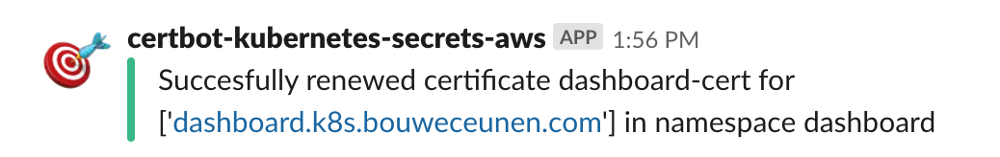

# certbot-kubernetes-secrets-aws
Obtains Let's Encrypt certificates, pushes these as Secrets on Kubernetes for Ingresses and creates Route53 entries in AWS.

[](https://hub.docker.com/r/bouwe/certbot-kubernetes-secrets-aws)

## Installation
```
kubectl apply -f kubernetes/
```

## Environment Variables
The configmap contains environment variables which can be used to configure Slack notifications and are used for Let's Encrypt certficate requests. The EMAIL environment variable is mandatory, the rest are optional. If no annotations are set on the ingresses but you would want to use a default elb, you can set the right environment variables so you can just omit these annotations on your ingresses.

* EMAIL
* SLACK_WEBHOOK
* DEAULT_ELB_DNS_NAME
* DEAULT_ELB_REGION

## AWS Policy
Attach following policy to your EC2 node role in IAM on AWS in order for Route53 entries to be manipulated.

```
{
    "Version": "2012-10-17",
    "Statement": [
        {
            "Sid": "",
            "Effect": "Allow",
            "Action": [
                "route53:ChangeResourceRecordSets",
                "route53:GetChange",
                "route53:GetChangeDetails",
                "route53:ListHostedZones",
                "route53:CreateHostedZone",
                "route53:DeleteHostedZone",
                "route53:GetHostedZone"
            ],
            "Resource": [
                "*"
            ]
        },
        {
            "Sid": "",
            "Effect": "Allow",
            "Action": [
                "elasticloadbalancing:DescribeLoadBalancers"
            ],
            "Resource": [
                "*"
            ]
        }
    ]
}
```

## Slack Notifications
Slack notifications are sent when something goes wrong and if a certificate has been renewed. Setting the environment variable 'SLACK_WEBHOOK' will result in Slack messages being sent.

[](images/slack_success.png)

[](images/slack_failure.png)

## Ingress Annotations
Several annotations need to be present on the Ingress in order to set Route53 records. 
* certbot.kubernetes.secrets.aws/elb-dns-name
* certbot.kubernetes.secrets.aws/elb-region

Certificates are requested when the 'tls' annotation with a secretName is present on the Ingress.

```
kind: Ingress
apiVersion: extensions/v1beta1
metadata:
  name: cluster-ingress
  namespace: kube-system
  annotations:
    ingress.kubernetes.io/ssl-redirect: 'true'
    ingress.kubernetes.io/auth-type: forward
    ingress.kubernetes.io/auth-url: http://traefik-forward-auth.kube-system.svc.cluster.local
    ingress.kubernetes.io/auth-response-headers: X-Forwarded-User
    certbot.kubernetes.secrets.aws/elb-dns-name: a4d9acea544d511e9aef50ae120ed3e3-483026455.us-east-1.elb.amazonaws.com
    certbot.kubernetes.secrets.aws/elb-region: us-east-1
spec:
  rules:
  - host: cluster.k8s.bouweceunen.com
    http:
      paths:
      - path: /
        backend:
          serviceName: kubernetes-dashboard
          servicePort: web
  tls:
  - secretName: cluster-cert
```

## TODO
* option to turn on json logging
* don't upsert Route53 record if already exists
* renewal of certificates
